# Credit_Risk_Analysis
LendingClub, a peer-to-peer lending services company, is looking to predict the high risk customers for their credit cards. As part of the project I have used the oversampling algorithms, RandomOverSampler and SMOTE, and undersampling ClusterCentroids algorithm. I have also used combinatorial approach of over- and undersampling using the SMOTEENN algorithm.  
Next, I used two new machine learning models that reduce bias, BalancedRandomForestClassifier and EasyEnsembleClassifier, to predict credit risk. 
  
Based on the results of above algorithms, recommendation is made on whether they should be used to predict credit risk.
  
## Results

### Naive Random Oversampling
Following metrics are generated from Naive Random Oversampling algorithm:
 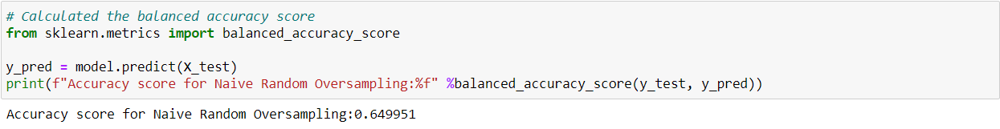
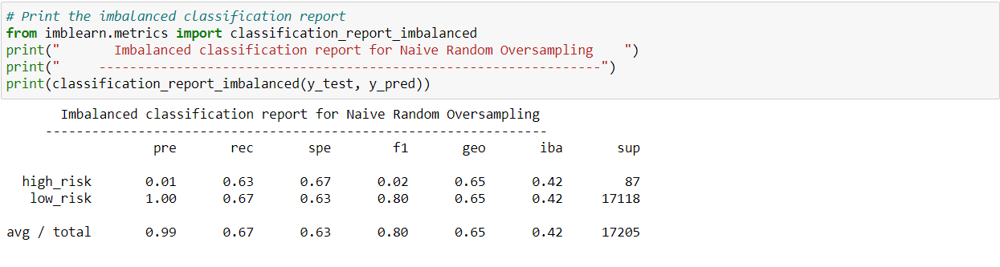
 
The data shows that the accuracy of the model (64%) is decent and the sensitivity score for low and high risk clients are pretty similar. This algorithm could be a good model to adopt. 
  
### SMOTE
Following metrics are generated from SMOTE oversampling algorithm: 
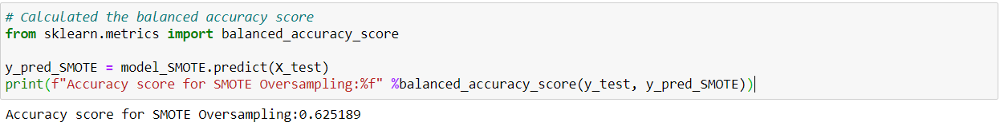 
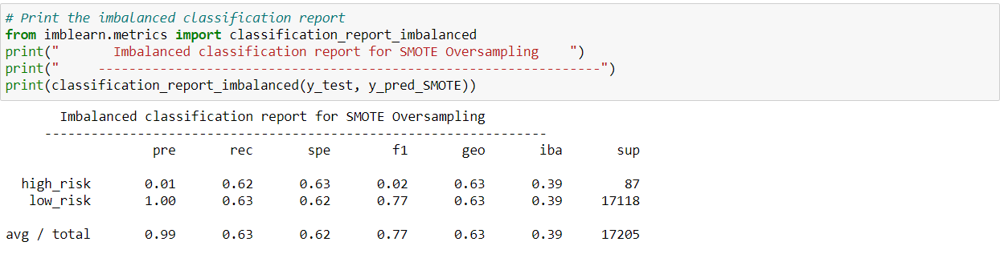 

The data from SMOTE algorithm is very similar to that of Naive Random Oversampling algorithm and could be considered for predicting high risk customers.
  
### Cluster Centroids
Following metrics are generated from Cluster Centroids undersampling algorithm: 
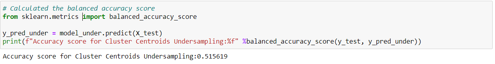 
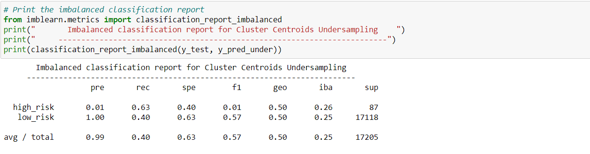 

Cluster Centroid's accuracy, precision, recall and F1 scores are all very low. Hence, this algorithm is not recommended.
  

### SMOTEENN
The combinational approach of oversampling and undersampling produced following metrics: 
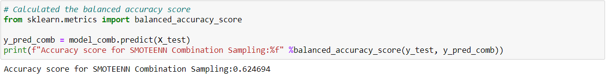 
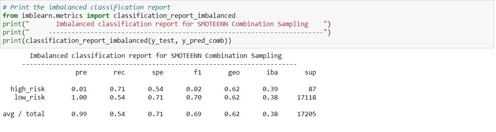 

SMOTEENN algorithm doesn't have a decent accuracy score as well a huge disparity in sensitivity score for low and high risk customers. Hence, this model cannot be recommended.

### BalancedRandomForest
Next we look into ensemble learning algorithms for our prediction model. The metrics generated from BalancedRandomForest ensemble learner is as follows: 
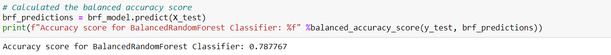 
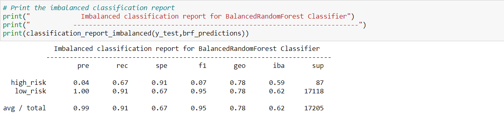 
The accuracy score from this model, 78%, is decent. However, there is disparity in sensitivity score between high and low customers. Hence, I would not recommend this model.
  

### Easy Ensemble AdaBoost
The easy ensemble AdaBoost algorithm produced the following metrics: 
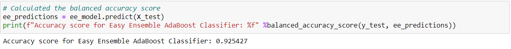 
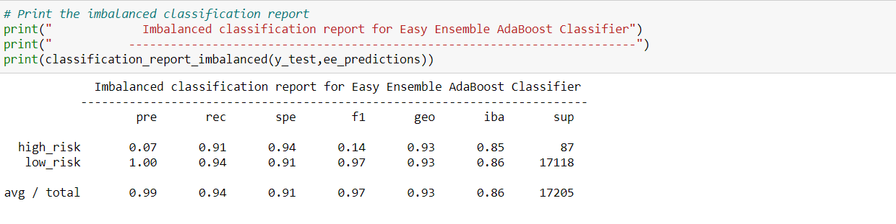 
The accuracy of this algorithm is very high, 93%. The sensitivity score also looks good for both high and low risk customers. This model can be adopted to predict high risk customers.
   

## Summary
Of all the models we tried here, the Easy Ensemble AdaBoost model looks most promising for LendingClub to adopt to predict high risk customers.  
**However, due to huge disparity in sampling of high and low risk customers, I would recommend to first scale the sampling data, apply the AdaBoost algorithm and analyze the new metrics before the final decision.** 
